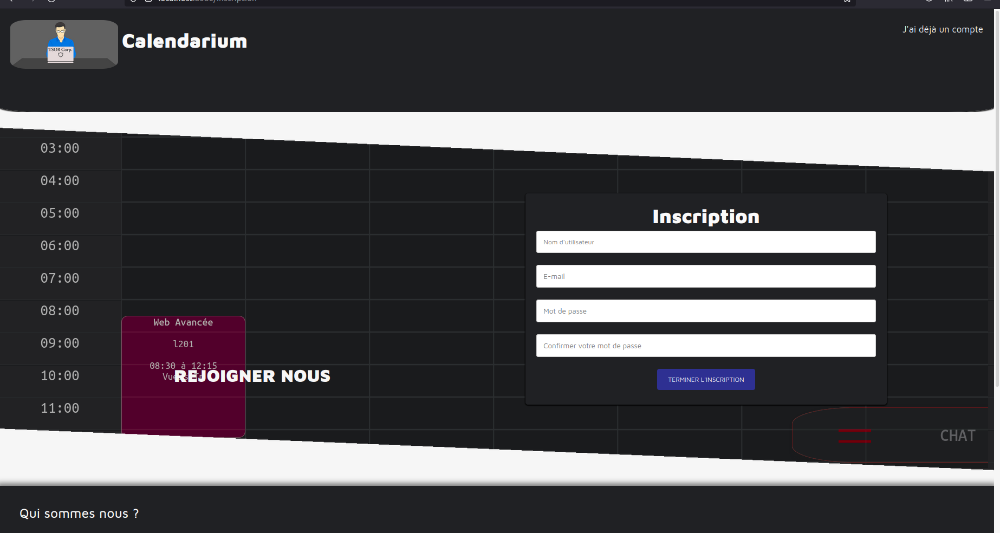

# Abyss project RENDU Final 

## Description
L'objectif de ce projet est de réaliser un emploi du temps collaboratif qui se dessine et qui est interactif (possibilité d’interaction avec l’agenda) en utilisant toutes les technologies vues en cours et qui est OPEN SOURCE, aucun framework ou code externe n’est utilisé en dehors de ceux imposés dans la consigne.
Choix de switcher entre les parties directement depuis le menu principale :
- Une partie en Thymeleaf où nous avons utilisé la technologie CANVAS pour représenter l’agenda.
- Une partie en VueJS où nous avons utilisé la technologie SVG que vous nous avez présentée en cours pour refaire l’agenda.
La différence entre ces deux technologies réside dans  le fait que le “canvas” n’est qu’un dessin alors que le “svg” dessine des éléments dans le DOM et donc possède davantage de possibilités techniques.
Le canvas serait utile pour des performances en jeu et des dessins plus poussés.
- Les fonctionnalités du site sont accessibles uniquement si vous êtes authentifiés/inscrits, sur cette première page vous avez accès à l’explication des fonctionnalités du projet et à un tutoriel.
 A partir de cette première page vous pouvez vous diriger vers la page d'inscription si cela n'est pas fait, et vous pouvez revenir sur la page de login. Suite à l'authentification, vous pouvez créer un nouvel agenda et y ajouter des personnes, ainsi que des items avec l'horaire, le lieu et la date et sa description pour qu'ils soient dessinés pour la semaine en cours, et listés pour toutes les personnes qui font partie du groupe. Vous disposez d'une messagerie pour communiquer avec votre groupe, les autres pages concernent l'administration de votre profil, la page d'administration des membres (uniquement possible si vous disposez des droits administrateur) ainsi qu'un formulaire de contact par e-mail.
 
## Lancement
Lancer l'application à travers le serveur Spring et connecter vous à votre localhost :
http://localhost:8080

## Listing des fichiers

### Thymeleaf
- **Interface de connection/inscription :** `login.html` - `inscription.html`
- **Page principale :** `home.html` - `schedule.html`
- **Page secondaire :** `actualite.html` - `help.html` - `user.html`
- **Page administrateur :** `administration.html` - `update-user`
- **Autre page :** `error.html`

### VueJS 
La structure est similaire mais toutes les pages sont des script lancés dans “index.html” et gérées avec les routes implantées avec un routeur.
Les liens des pages sont les mêmes que les fichiers en question sans l'extension, la sécurité est gérée par spring security.

## Fonctionnalités
- Inscription/connexion.

- Créer des agendas.

- Ajouter des personnes à un agenda commun.

- Ajouter des éléments à l'agenda si vous êtes l’administrateur de l’agenda en question.

- Lister l'agenda.
- Possibilité de modifier l’agenda “drag and drop” avec des animations.
- Gestion des dates, affichage de la semaine en cours et parcours des différentes semaines.
- Dessiner l'agenda journée de travail 8-18 ou normal.

- Totalement responsive, peut être utiliser sur téléphone.
- Participer à un chat avec le groupe de l'agenda.
- Envoyer et lire des messages privés.
- Gestion des utilisateurs par l'admin.
- Gestion de votre profil utilisateur.
- Contacter pour avoir de l'aide.

## Languages & technologies
Java / Javascript / HTML / CSS / Thymeleaf / Spring boot / VueJS / Svg / Canvas 

## Élément externe
- Les fonts utilisés, vous trouverez la licence dans le fichier font du projet ofl.
- Les diverses images proviennent d’une banque d’images libres (https://pixabay.com/fr/).
- Tout le reste provient de nous, avec le suivi de vos cours.
